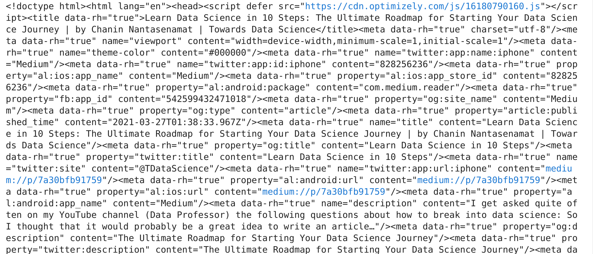
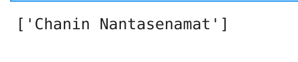
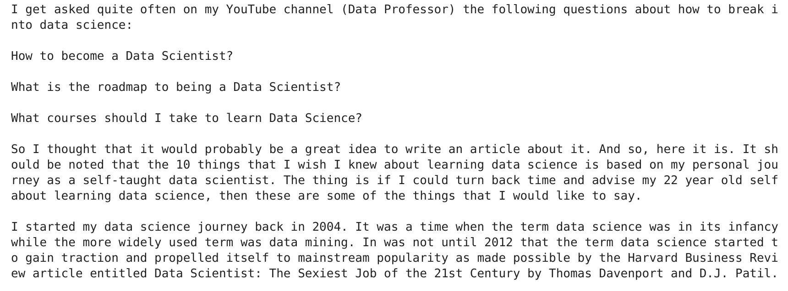
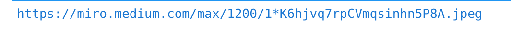
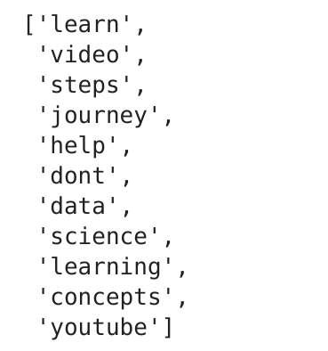
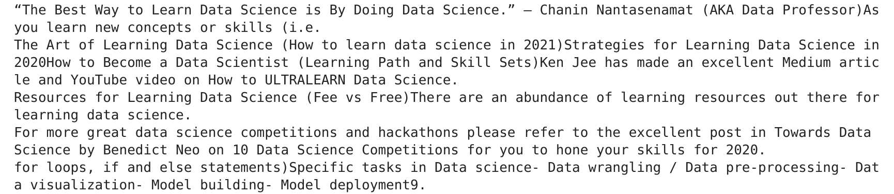

# Web scraping usando newspaper3k

0. [Instalar newspaper3k ](#schema0)
1. [Importar librerías](#schema1)
2. [Cargar el artículo](#schema2)
3. [Analizar el artículo](#schema3)
4. [NPL](#schema4)
5. [Documentación](#schema5)

# 0. Instalar newspaper3k 

~~~python
conda install -c conda-forge newspaper3k
~~~

# 1. Importar librerías
~~~python

from newspaper import Article
~~~

# 2. Cargar el artículo
~~~python
url = "https://towardsdatascience.com/10-things-i-wish-i-knew-about-learning-data-science-7a30bfb91759"
article = Article(url)
article.download()
# si quieren ver el articulo en html pueden imprimirlo
#print(article.html)
~~~

# 3 Analizar el artículo

~~~python
article.parse()
~~~
### Obtenemos el autor

~~~python
article.authors
~~~

### El artículo en `texto`
~~~python
print(article.text)
~~~

### Obtenr la imagen del artículo
~~~python
print(article.top_image)
~~~

# 4. NPL

~~~python
import nltk
nltk.download('punkt')
article.nlp()
~~~
### Obtenemos las palabras claves
~~~python
article.keywords
~~~

~~~python
print(article.summary)
~~~

# 5. Documentación
Documentación de  librería: https://pypi.org/project/newspaper3k/

Vídeo seguido:
https://www.youtube.com/watch?v=Hfry5XnISyc